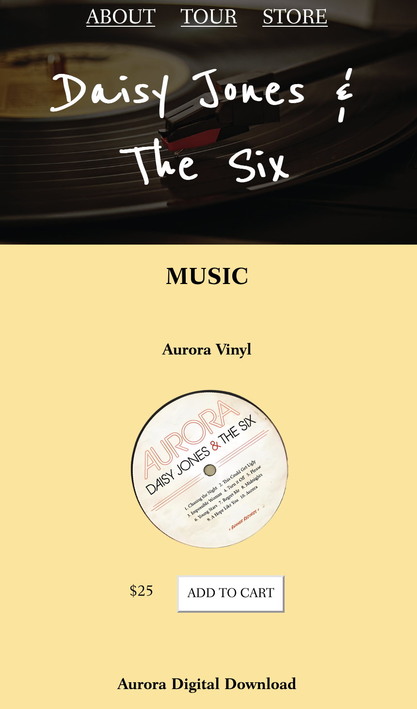
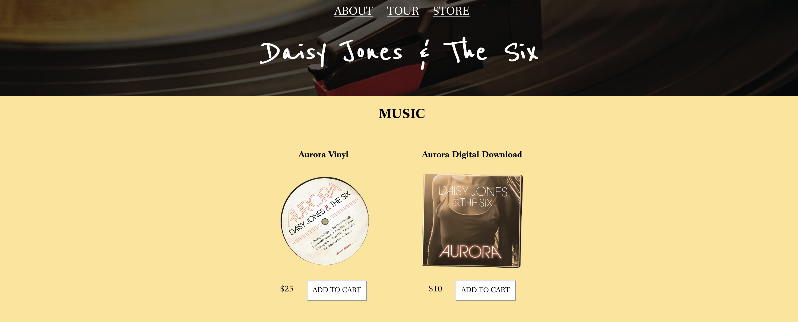
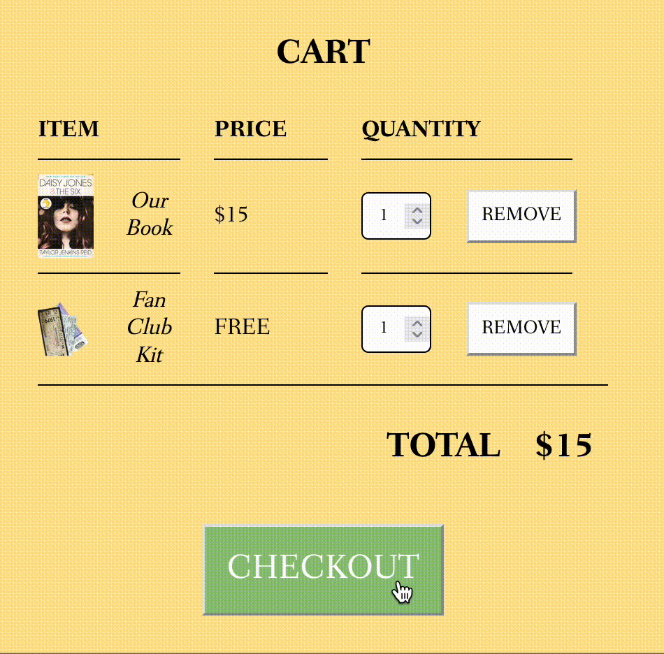
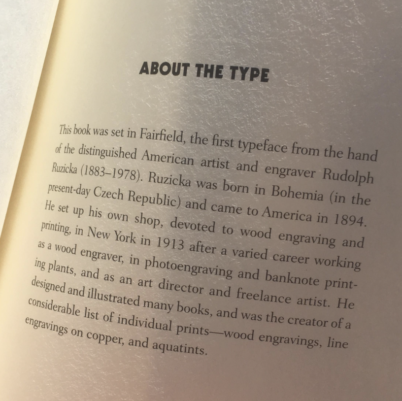

# Band Website 🎸
Welcome to my first website! Here, you’ll find a traditional band website reimagined for a fictional band from the novel [*Daisy Jones & The Six*](https://www.goodreads.com/book/show/40597810-daisy-jones-the-six) by [Taylor Jenkins Reid](https://taylorjenkinsreid.com).

  

This project marks my foray into web development. Access the website [**HERE**](https://vvhawk.github.io/band-website/index.html)  
 

*With everything I create, I strive to give it a pretty face. Design is essential to me. The basis for this design was to capture the vintage 70s aesthetic of the book and envoke the feeling of watching a sunset in Los Angeles.*

  

*If you have any further questions, feel free to [reach out](https://github.com/vvhawk)!*

## Overview

  

This responsive website can be broken down into

- [ABOUT](#about) 
- [TOUR](#tour)
- [STORE](#store)

  

The footer of each page contains links to the [BOOK](https://www.goodreads.com/book/show/40597810-daisy-jones-the-six) and [SHOW](). 

## Implementation
[HTML](https://en.wikipedia.org/wiki/HTML), [CSS](https://en.wikipedia.org/wiki/CSS), and [JavaScript](https://en.wikipedia.org/wiki/JavaScript) were all utilized to craft this experience.

## ABOUT
- A simple page that contains a beautiful image of the band that lights up when you hover over it

  

## TOUR
- An extensive page that highlights the electric teaser for the upcoming adaptation
- Followed by a list of locations along with a button to "GET TICKETS"
- Clicking the button will bring you to the Wikipedia page of the venue so you can read about its music history

  

## STORE
- A dynamic page that contains a fully functional shopping cart
- Add items or change the quantity and watch the price adjust accordingly

  

## Responsive Design
- A design that adapts to different screen sizes

Small            |  Large
:-------------------------:|:-------------------------:
  |  

## Easter Eggs
### Fan Club Kit
- Click checkout in the store to say hello to your FREE fan club kit

  

### Familiar Font
- This website uses the same font as the book

  

## Credits
- Thanks to [Taylor Jenkins Reid](https://taylorjenkinsreid.com) for the inspiration
- Thanks to [WebDevSimplified](https://www.youtube.com/@WebDevSimplified/featured) for the knowledge 

