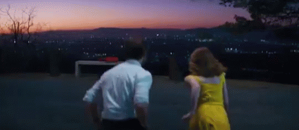

# Band Website
Welcome to my first website! Here, you’ll find a traditional band website reimagined for a fictional band from the novel [*Daisy Jones & The Six*](https://www.goodreads.com/book/show/40597810-daisy-jones-the-six), by [Taylor Jenkins Reid](https://taylorjenkinsreid.com).

  

This project marks my forray into web development.  

With everything I create, I strive to make it pretty to look at. Design is essential to me. The basis for my design was to capture the vintage 70s aesthetic of the book, and envoque the feeling of watching a sunset in Los Angelas. 

  

Access the website [**HERE**](https://vvhawk.github.io/band-website/index.html)

*If you have any further questions, feel free to [reach out](https://github.com/vvhawk)!*

## Overview
This website can be broken down into

- [ABOUT](#about) 
- [TOUR](#tour)
- [STORE](#store)

The footer of each page contains links to the [book](https://www.goodreads.com/book/show/40597810-daisy-jones-the-six) and [tv show](). 

## Implementation
[HTML](https://en.wikipedia.org/wiki/HTML), [CSS](https://en.wikipedia.org/wiki/CSS), and [JavaScript](https://en.wikipedia.org/wiki/JavaScript) were all utilized to craft this experience.

## ABOUT

## TOUR

## STORE

## Credits
